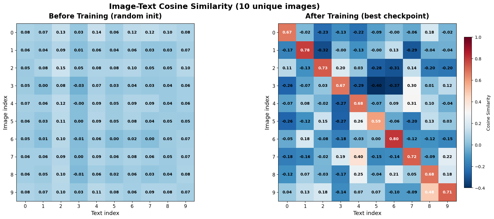
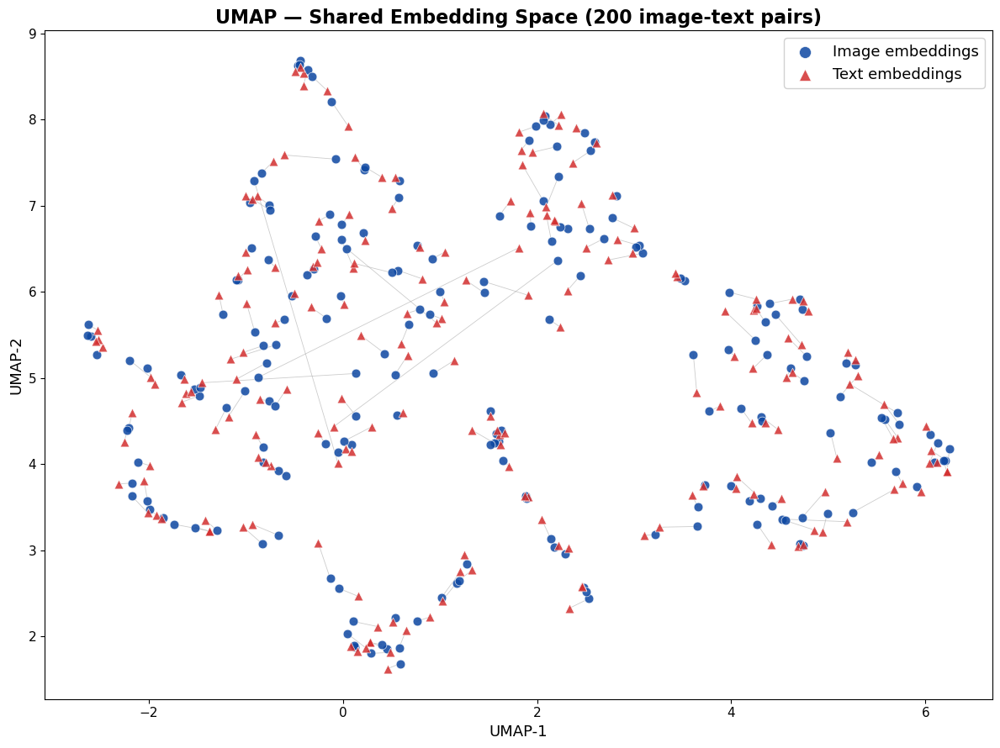

# Crossmodal Retrieval

A miniature CLIP-style contrastive learning system built from scratch with PyTorch. Two encoders — one for images, one for text — are trained jointly to align their representations in a shared 256-dimensional embedding space, enabling text-to-image retrieval.

## Overview

The model learns by pulling together embeddings of matching image-caption pairs while pushing apart non-matching ones within each batch (InfoNCE loss). After training, a text query can be encoded and compared against all image embeddings to retrieve the most semantically similar images.

```
Text: "a dog running on the beach"
         │
    [TextEncoder]          [ImageEncoder]
    BERT + projection      ResNet18 + projection
         │                       │
    256-d embedding ──── cosine similarity ──── ranked images
```

## Dataset

[Flickr8k](https://www.kaggle.com/datasets/adityajn105/flickr8k) — 8,092 images with 5 human-written captions each (~40k image-text pairs total).

The dataset is downloaded automatically via `kagglehub` when the notebook is first run. A [Kaggle account and API token](https://www.kaggle.com/settings/account) are required.

## Architecture

| Component | Details |
|---|---|
| Image encoder | ResNet18 (pretrained on ImageNet) → projection head (512 → 256 → 256) → L2 norm |
| Text encoder | BERT `bert-base-uncased` → [CLS] token → projection head (768 → 256 → 256) → L2 norm |
| Loss | InfoNCE (symmetric cross-entropy over the N×N cosine similarity matrix) |
| Temperature | Learnable log-temperature, initialized at 0.07 |

## Training

| Hyperparameter | Value |
|---|---|
| Optimizer | Adam |
| Learning rate | 1e-4 |
| Batch size | 64 |
| Epochs | 10 |
| Embedding dim | 256 |
| Max token length | 64 |
| Train / val split | 90 / 10 (seed 42) |

### Results

| Epoch | Val Loss | Checkpoint |
|:---:|:---:|:---:|
| 1 | 0.7440 | saved |
| 2 | 0.5232 | saved |
| 3 | 0.4639 | saved |
| **4** | **0.4059** | **saved ← best** |
| 5 | 0.4071 | |
| 6 | 0.4091 | |
| 7 | 0.4568 | |
| 8 | 0.4479 | |
| 9 | 0.4275 | |
| 10 | 0.4300 | |

Best validation loss: **0.4059** at epoch 4. The model shows mild overfitting from epoch 5 onward (train loss ~0.13 vs val loss ~0.43), which is expected given the small dataset and large pretrained encoders.

Temperature decayed from 0.0698 → 0.0456 over training as the model sharpened its similarity distributions.

## Visualization

### Similarity Matrix

Cosine similarities between 10 unique image-text pairs, using the best checkpoint. A strong diagonal confirms that matched pairs score highest — the model correctly associates each image with its caption over all other captions in the set.



### UMAP Projection

200 image and text embeddings projected from 256-d to 2-d with UMAP (cosine metric). Blue circles are image embeddings, red triangles are text embeddings. Gray lines connect matching pairs — shorter lines indicate tighter alignment.



## Project Structure

```
crossmodal-retrieval/
├── train.ipynb        # Single self-contained notebook (data, models, training, visualization)
├── requirements.txt   # Python dependencies
├── assets/            # Output plots for README
│   ├── similarity_matrix.png
│   └── umap_embeddings.png
└── checkpoints/       # Saved model weights (gitignored)
    └── best_model.pt
```

All code lives in `train.ipynb`. Cell structure:

| Cells | Section |
|---|---|
| 1 | Install dependencies |
| 3 | Download Flickr8k dataset |
| 4–6 | Imports, config, device setup |
| 8–9 | Data pipeline (`Flickr8kDataset`, train/val split) |
| 11 | Image encoder |
| 13 | Text encoder |
| 15 | InfoNCE loss |
| 17 | Model and optimizer instantiation |
| 19 | Training functions |
| 21 | Training loop with checkpointing |
| 23–25 | Visualization (similarity matrix heatmap, UMAP) |

## Requirements

- Python 3.10+
- CUDA-capable GPU recommended (tested on NVIDIA H100 NVL)

```
torch
torchvision
transformers
kagglehub
umap-learn
matplotlib
```

## Setup

**Local**
```bash
git clone https://github.com/ardaerdogan/crossmodal-retrieval
cd crossmodal-retrieval
python -m venv venv && source venv/bin/activate
pip install torch torchvision transformers kagglehub umap-learn matplotlib
jupyter notebook train.ipynb
```

**JupyterHub**

Clone the repo inside JupyterHub, then open `train.ipynb` and run all cells. The first two cells install dependencies and download the dataset automatically.

A Kaggle token must be configured before the dataset cell runs:
```bash
mkdir -p ~/.kaggle
echo '{"username":"YOUR_USERNAME","key":"YOUR_API_KEY"}' > ~/.kaggle/kaggle.json
chmod 600 ~/.kaggle/kaggle.json
```

## References

- Radford et al., [Learning Transferable Visual Models From Natural Language Supervision](https://arxiv.org/abs/2103.00519) (CLIP), OpenAI 2021
- He et al., [Deep Residual Learning for Image Recognition](https://arxiv.org/abs/1512.03385) (ResNet), 2015
- Devlin et al., [BERT: Pre-training of Deep Bidirectional Transformers](https://arxiv.org/abs/1810.04805), 2018
- van den Oord et al., [Representation Learning with Contrastive Predictive Coding](https://arxiv.org/abs/1807.03748) (InfoNCE), 2018
