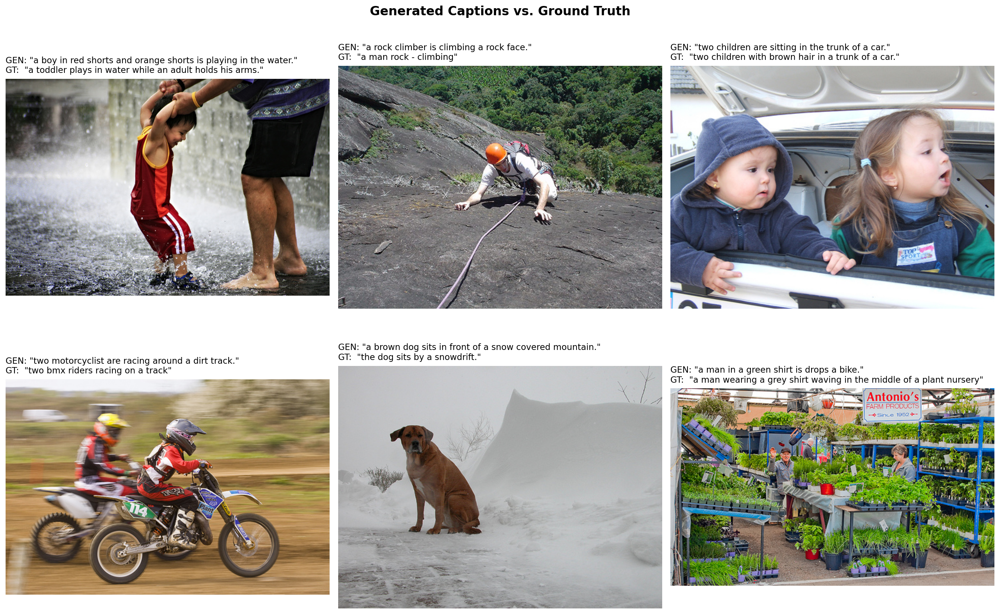

# Crossmodal Generation — Image Captioning

An image captioning model built from scratch with PyTorch. A ResNet18 encoder produces a grid of spatial image features; a transformer decoder cross-attends to those features and autoregressively generates a caption, one token at a time.

## Overview

The task is **cross-modal generation**: conditioned on an image (non-text modality), the model produces text (a natural-language caption). During training, the decoder is shown ground-truth tokens shifted right (*teacher forcing*) and predicts the next token at every position. At inference, it generates one token at a time (greedy decoding), stopping on `[SEP]` or at max length.

```
Image (224×224)                Caption tokens (shifted right)
      │                                       │
[ResNet18 → 7×7×512]              [Token + position embeddings]
      │                                       │
[1×1 conv → d_model]                          │
      │                                       │
  49 image "tokens" ────cross-attention────> [Transformer Decoder × N]
                                              │
                                       [Linear → vocab logits]
                                              │
                                       next-token prediction
```

## Dataset

[Flickr8k](https://www.kaggle.com/datasets/adityajn105/flickr8k) — 8,091 images with 5 human-written captions each (~40k image-caption pairs).

The dataset is downloaded automatically via `kagglehub` when the notebook is first run. A [Kaggle account and API token](https://www.kaggle.com/settings/account) are required.

## Architecture

| Component | Details |
|---|---|
| Image encoder | ResNet18 (pretrained on ImageNet), truncated before global pooling → 7×7×512 feature map → 1×1 conv projects each cell to 256-d → flattened to 49 "image tokens" |
| Tokenizer | BERT `bert-base-uncased` WordPiece (~30k vocab). `[CLS]` is reused as BOS, `[SEP]` as EOS, `[PAD]` (id 0) is ignored by loss and attention |
| Decoder | 4-layer transformer decoder (`nn.TransformerDecoder`), `norm_first=True`, causal self-attention + cross-attention to the 49 image tokens, learned token + position embeddings |
| Output head | Linear → vocab logits, **weight-tied** to the input token embedding |
| Loss | Cross-entropy over predicted-vs-next-token, `ignore_index=pad_id` |
| Retrieval (demo) | CLIP ViT-B/32 — pretrained joint image-text encoder. Cosine similarity in the shared embedding space ranks images for a text query. Embeddings are computed once and cached in `dataset/clip_embeddings.pt`. |

## Training

| Hyperparameter | Value |
|---|---|
| Optimizer | AdamW |
| Learning rate | 3e-4 |
| Batch size | 64 |
| Epochs | 20 |
| Max token length | 32 |
| `d_model` | 256 |
| Attention heads | 4 |
| Decoder layers | 4 |
| FFN dim | 1024 |
| Dropout | 0.1 |
| Gradient clip (max-norm) | 1.0 |
| Train / val split | 90 / 10 (seed 42) |

### Results

| Epoch | Val Loss | Val PPL | Checkpoint |
|:---:|:---:|:---:|:---:|
| 1  | 5.1747 | 176.74 | saved |
| 2  | 4.1907 | 66.07  | saved |
| 3  | 3.7755 | 43.62  | saved |
| 4  | 3.4815 | 32.51  | saved |
| 5  | 3.3075 | 27.32  | saved |
| 6  | 3.2293 | 25.26  | saved |
| 7  | 3.1301 | 22.88  | saved |
| 8  | 3.0613 | 21.35  | saved |
| 9  | 3.0237 | 20.57  | saved |
| 10 | 3.0123 | 20.34  | saved |
| 11 | 2.9936 | 19.96  | saved |
| **12** | **2.9827** | **19.74** | **saved ← best** |
| 13 | 2.9895 | 19.88  | |
| 14 | 3.0294 | 20.69  | |
| 15 | 3.0186 | 20.46  | |
| 16 | 3.0274 | 20.64  | |
| 17 | 3.1100 | 22.42  | |
| 18 | 3.1065 | 22.34  | |
| 19 | 3.1386 | 23.07  | |
| 20 | 3.1152 | 22.54  | |

Best validation loss **2.9827** (PPL 19.74) at epoch 12. Perplexity — `exp(loss)` — is the more interpretable metric here: on average the model is choosing the correct next word from ~20 plausible candidates out of a 30k vocabulary. Mild overfitting appears from epoch 13 onward as train loss continues to drop while val loss creeps up. Each epoch takes ~53s on an NVIDIA H100.

## Visualization

### Generated Captions vs. Ground Truth

Six unique images from the validation set, with the model-generated caption next to a human-written reference.



## Demo

After training, run the Flask web app to caption any image and retrieve images by text:

```bash
python demo.py                   # local only       →  http://127.0.0.1:7860
python demo.py --port 8080       # custom port
python demo.py --host 0.0.0.0    # accept LAN connections
python demo.py --debug           # auto-reload on code change
```

Two sections, one page:
- **Text → Image Retrieval** — CLIP encodes your query, ranks all indexed images by cosine similarity, and the captioning model describes the top 3 matches.
- **Image → Caption** — drag and drop any image; the model generates a caption with greedy decoding.

The demo needs only the captioning **checkpoint** to start. Retrieval works against the full Flickr8k dataset if available, otherwise it falls back automatically to the small `examples/` folder.

## Project Structure

```
crossmodal-retrieval/
├── train.ipynb              # Self-contained notebook: data, model, training, eval
├── demo.py                  # Flask web demo (loads checkpoint + CLIP, exposes 3 routes)
├── templates/
│   └── index.html           # Single-page frontend (vanilla HTML/CSS/JS)
├── examples/                # 6 sample images — retrieval fallback when dataset is absent
├── requirements.txt         # Python dependencies
├── assets/
│   └── captioning_demo.png  # Generated caption demo (committed)
├── checkpoints/             # Saved model weights (gitignored — must be obtained separately)
│   └── best_caption_model.pt
└── dataset/                 # Full Flickr8k (gitignored — optional, retrieval works without it)
    ├── Images/
    ├── captions.txt
    └── clip_embeddings.pt   # CLIP embeddings cache, auto-generated on first run
```

All code lives in `train.ipynb`. Cell structure:

| Cells | Section |
|---|---|
| 1 | Install dependencies |
| 3 | Download Flickr8k dataset |
| 4–6 | Imports, config, device setup (GPU pinning via `CUDA_VISIBLE_DEVICES`) |
| 8–9 | Data pipeline (`Flickr8kDataset`, train/val split) |
| 11 | Image encoder (ResNet18 → 49 image tokens) |
| 13 | Caption decoder (transformer with causal self-attn + cross-attn) |
| 15 | Model and optimizer instantiation |
| 17 | Training functions (teacher-forced loss, validation) |
| 19 | Training loop with best-checkpoint saving |
| 21 | Greedy caption generation |
| 23 | Demo grid (generated vs. ground-truth captions) |

## Key Concepts

- **Teacher forcing** — at training time the decoder is fed the ground-truth previous tokens rather than its own predictions, so every position can be trained in parallel.
- **Causal mask** — upper-triangular mask that blocks each token from attending to future positions, enforcing left-to-right autoregressive behavior.
- **Cross-attention** — lets each decoder position query the 49 image tokens; this is how the image conditions the generated text.
- **Weight tying** — the output projection reuses the input embedding matrix. Halves the parameter count of the head and usually improves generalization.
- **Greedy decoding** — at each step, pick the token with the highest probability and append it. Simple and deterministic; beam search would improve fluency at extra compute cost.

## Requirements

- **Python 3.10+**
- **~3 GB of disk** for the PyTorch + transformers stack
- **GPU optional** — the demo runs on CPU (slower captioning) or Apple Silicon MPS. Training needs a CUDA GPU (tested on NVIDIA H100 NVL).

Python packages (also listed in `requirements.txt`):

```
torch          # model
torchvision    # ResNet18 + image transforms
transformers   # BERT tokenizer + CLIP
flask          # web demo
Pillow         # image I/O
kagglehub      # dataset download (training only)
matplotlib     # plots (training only)
nltk           # BLEU evaluation (training only)
```

## Setup — for collaborators

This is the fastest path to running the demo locally. **You do not need to train the model** — just grab the checkpoint.

### 1. Clone the repo

```bash
git clone https://github.com/ardaerdogani/crossmodal-retrieval
cd crossmodal-retrieval
```

### 2. Create a virtual environment

A *virtual environment* (`venv`) is an isolated Python install so this project's packages don't conflict with anything else on your machine.

```bash
python -m venv venv
source venv/bin/activate          # macOS / Linux
# venv\Scripts\activate           # Windows PowerShell
```

You'll know it's active when your shell prompt starts with `(venv)`.

### 3. Install dependencies

```bash
pip install --upgrade pip
pip install -r requirements.txt
```

This downloads PyTorch, transformers, Flask, and friends. First install takes ~2–5 minutes depending on your connection.

### 4. Get the model checkpoint

The trained weights (`best_caption_model.pt`, ~95 MB) are **not in the repo** — they're too large for git. Ask Arda for the file, then drop it here:

```
crossmodal-retrieval/
└── checkpoints/
    └── best_caption_model.pt        ← place the file here
```

> **Optional:** to run text-to-image retrieval against the full 8 k Flickr dataset rather than the 6 example images, also place `dataset/Images/` + `dataset/captions.txt` in the project root. Without it the demo falls back to `examples/` automatically.

### 5. Run the demo

```bash
python demo.py
```

Then open **<http://127.0.0.1:7860>** in your browser.

First launch is slow (~30 s): it downloads the BERT tokenizer + CLIP weights from Hugging Face (cached in `~/.cache/huggingface/` for future runs) and computes CLIP embeddings for the image index.

## Setup — for training from scratch

Follow steps 1–3 above, then:

```bash
jupyter notebook train.ipynb
```

A Kaggle token is needed for the dataset download. Generate one at <https://www.kaggle.com/settings/account>, then:

```bash
mkdir -p ~/.kaggle
echo '{"username":"YOUR_USERNAME","key":"YOUR_API_KEY"}' > ~/.kaggle/kaggle.json
chmod 600 ~/.kaggle/kaggle.json
```

On a shared GPU host, edit the `CUDA_VISIBLE_DEVICES` line in the device-setup cell to pick a free GPU before the kernel first touches CUDA.

## API reference

The Flask backend exposes three routes (`templates/index.html` is the bundled frontend, but you can call them from any client):

| Method | Path | Body | Returns |
|---|---|---|---|
| `GET`  | `/`         | — | The HTML demo page |
| `POST` | `/caption`  | `multipart/form-data` with an `image` file | `{"caption": "..."}` |
| `POST` | `/retrieve` | JSON `{"query": "..."}` | `[{"image": "data:image/jpeg;base64,...", "score": 0.873, "caption": "..."}, ...]` (top 3) |

Example with `curl`:

```bash
# caption an image
curl -F "image=@examples/717673249_ac998cfbe6.jpg" http://127.0.0.1:7860/caption

# retrieve images for a text query
curl -X POST http://127.0.0.1:7860/retrieve \
     -H "Content-Type: application/json" \
     -d '{"query": "a dog on the beach"}'
```

## Troubleshooting

| Symptom | Likely cause / fix |
|---|---|
| `FileNotFoundError: Checkpoint not found at 'checkpoints/best_caption_model.pt'` | Step 4 was skipped — place the checkpoint file in `checkpoints/`. |
| `ModuleNotFoundError: No module named 'flask'` | The `venv` isn't active. Re-run `source venv/bin/activate`. |
| Server starts but `/retrieve` returns *"no image index available"* | No `dataset/Images/` **and** no `.jpg`/`.png` in `examples/`. Add at least one image to `examples/` and restart. |
| First request is very slow | First call after startup compiles CLIP kernels; subsequent calls are ~10× faster. |
| Port 7860 already in use | Run with `--port 8080` (or any free port). |
| macOS: "torch not compiled with CUDA" warning | Expected — the demo will use MPS (Apple Silicon) or CPU. No action needed. |

## References

- Vaswani et al., [Attention Is All You Need](https://arxiv.org/abs/1706.03762), 2017
- Xu et al., [Show, Attend and Tell: Neural Image Caption Generation with Visual Attention](https://arxiv.org/abs/1502.03044), 2015
- He et al., [Deep Residual Learning for Image Recognition](https://arxiv.org/abs/1512.03385) (ResNet), 2015
- Devlin et al., [BERT: Pre-training of Deep Bidirectional Transformers](https://arxiv.org/abs/1810.04805), 2018
